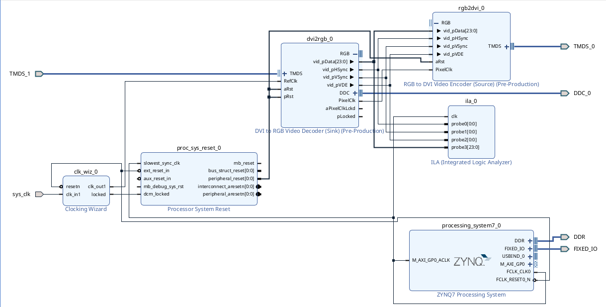
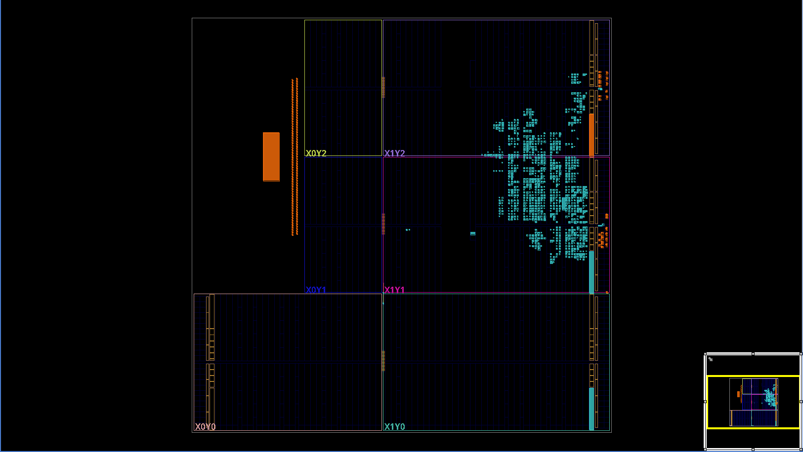
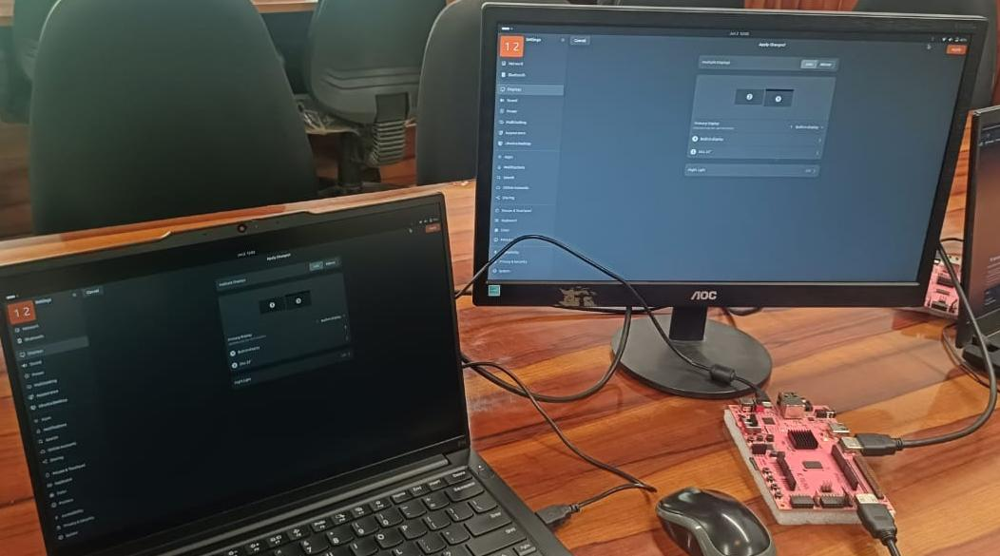
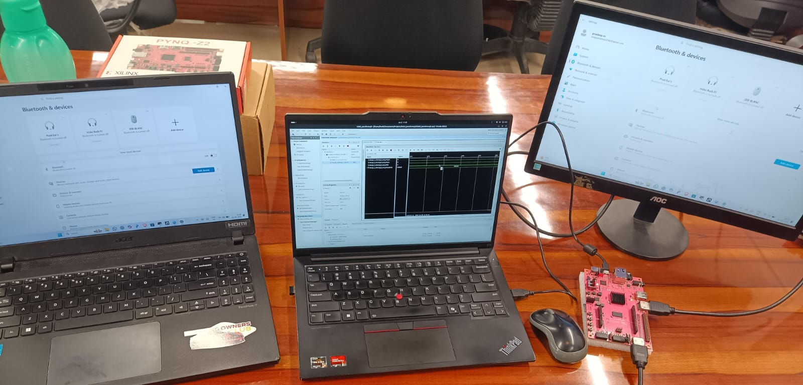
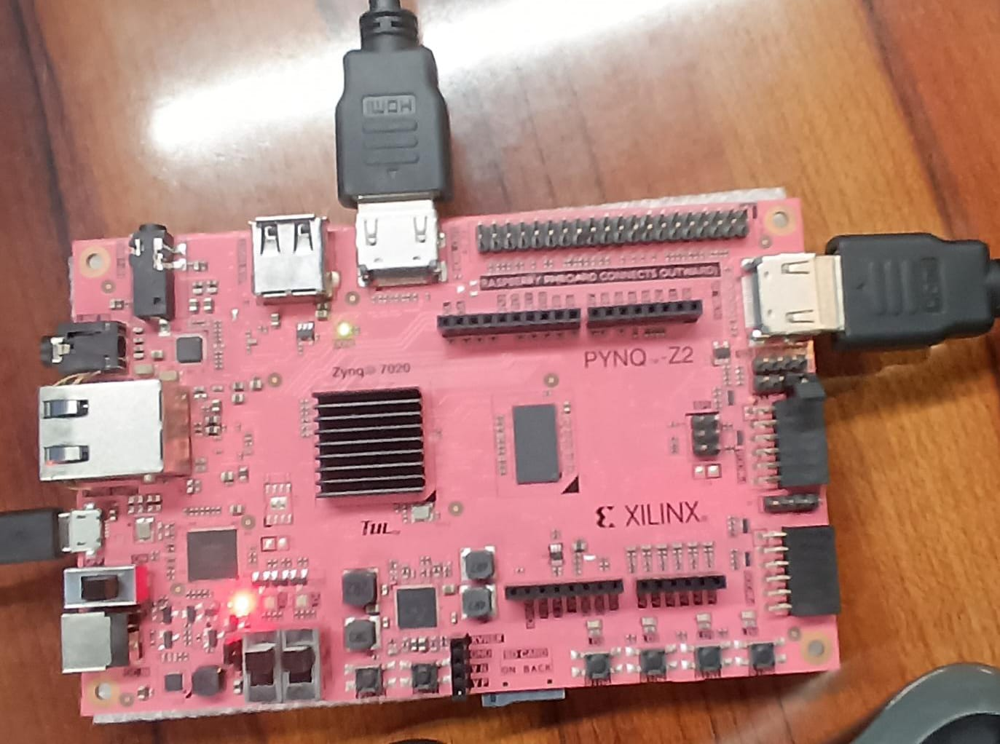

# HDMI Passthrough on PYNQ-Z2

A simple HDMI passthrough design for the **TUL PYNQ-Z2** that receives HDMI video through the onboard HDMI input and immediately retransmits it through the HDMI output using FPGA logic only.

The design operates entirely in Programmable Logic (PL) and does not use frame buffers, DDR memory, VDMA, or the ARM processor.

## Architecture

```text
HDMI Input
    │
    ▼
 dvi2rgb
    │
RGB + Sync Signals
    │
    ▼
 rgb2dvi
    │
    ▼
HDMI Output
```

Video data is passed directly from the HDMI receiver to the HDMI transmitter without intermediate storage.

## Features

* Pure FPGA implementation
* No DDR memory
* No VDMA
* No frame buffering
* No ARM software required
* Automatic resolution passthrough
* Near-zero latency

## Limitations

* Input and output clocks must remain synchronized
* No frame-rate conversion
* No resolution scaling
* No image processing
* Output resolution always matches input resolution

## IP Cores Used

| IP Core          | Purpose                                                     |
| ---------------- | ----------------------------------------------------------- |
| `dvi2rgb`        | HDMI/TMDS receiver                                          |
| `rgb2dvi`        | HDMI/TMDS transmitter                                       |
| `clk_wiz`        | Generates the 200 MHz reference clock required by `dvi2rgb` |
| `proc_sys_reset` | Reset synchronization                                       |
| `ila`            | Internal signal debugging                                   |

## Clocking

The design uses the PYNQ-Z2 onboard **125 MHz oscillator** as the primary clock source.

A Clock Wizard generates the **200 MHz reference clock** required by `dvi2rgb`.

The recovered pixel clock from `dvi2rgb` drives the HDMI transmit path.

## HDMI Support

* DDC (I²C) interface connected
* Hot-Plug Detect (HPD) asserted
* EDID communication supported through the Digilent HDMI IP

## Constraints

Additional placement and routing constraints are required to satisfy Xilinx 7-Series clocking requirements for the HDMI TX and RX paths.

These include:

* MMCM location constraints
* Dedicated clock routing overrides
* TMDS pin assignments
* HDMI DDC and HPD mappings

See `constraints.xdc` for implementation details.

### Vivado Block Design Layout
Below is the structural block connectivity diagram showing the continuous hardware processing loop:



### Implemented Silicon Device Floorplan
The physical placement map below demonstrates the hardware logic layout locked on the Zynq-7020 die:



## Tested Hardware

| Item      | Value                    |
| --------- | ------------------------ |
| Board     | TUL PYNQ-Z2              |
| FPGA      | XC7Z020-1CLG400C         |
| Toolchain | Vivado                   |
| Interface | HDMI Input → HDMI Output |

## Implementation Metrics & Resource Utilization

The design compiles completely to a valid binary bitstream configuration. Resource maps and timing margins extracted from the physical Post-Implementation layout on the Zynq-7020 die are structured below:

### Resource Utilization Summary


| Resource | Used | Available | Utilization % |
| -------- | ---- | --------- | ------------- |
| **LUT**  | 1603 | 53,200    | 3.01%         |
| **FF**   | 2201 | 106,400   | 2.07%         |
| **BRAM** | 1    | 140       | 0.71%         |
| **IO**   | 20   | 125       | 16.00%        |
| **BUFG** | 3    | 32        | 9.38%         |
| **MMCM** | 3    | 4         | 75.00%        |

### Timing Summary & Constraints Closure
* **Worst Negative Slack (WNS):** `-5.914 ns` (Asynchronous Paths Present)
* **Total Negative Slack (TNS):** `-314.229 ns`
* **Worst Hold Slack (WHS):** `+0.052 ns` (Met)
* **Total Number of Failing Endpoints:** 57

> 📌 **Timing Note:** The reported setup timing violation (WNS) is expected for this specific standalone, unbuffered architecture. Because the input video stream timing from the external `dvi2rgb` decoder block operates completely asynchronous to the internal 125 MHz system clock oscillator domain, cross-domain paths flag structural setup violations. To prevent these synthetic constraints from interfering with standard physical placement loops, specific routing lines are managed via `CLOCK_DEDICATED_ROUTE` bypass flags within the `.xdc` parameters.

### Hardware Environmental Metrics
* **Total On-Chip Power:** 1.901 W
* **Junction Temperature:** 46.9 °C
* **Thermal Margin:** 38.1 °C (Safe operating threshold)

### Demo - UBUNTU



### Demo - Windows



### Pynq Working



## Notes

This project is intended as a minimal HDMI passthrough reference design. It demonstrates TMDS reception, video extraction, and TMDS transmission entirely within FPGA fabric without external memory or software dependencies.

